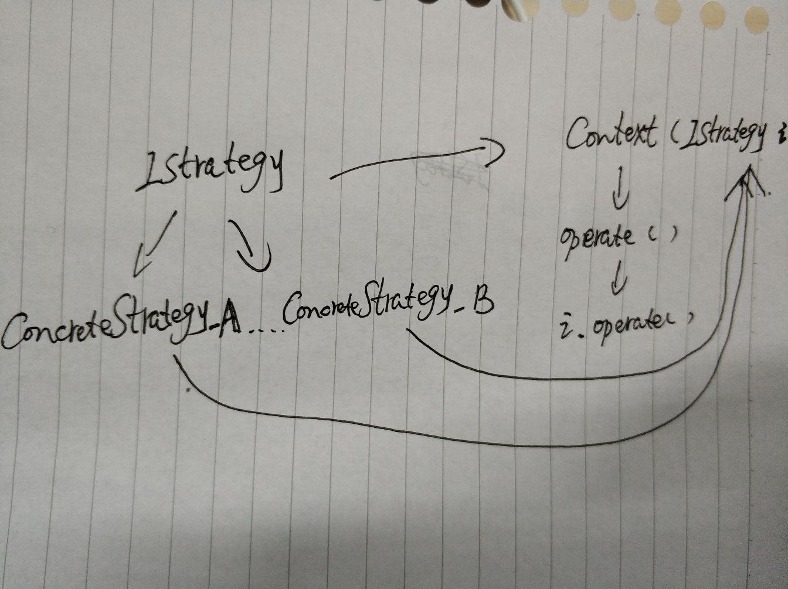

## 常见设计模式
---

### 动态代理
以retrofit为例：
```java
public <T> T create(final Class<T> service) {
    ...
    return (T) Proxy.newProxyInstance(service.getClassLoader(), new Class<?>[] { service },
        new InvocationHandler() {
          private final Platform platform = Platform.get();

          @Override public Object invoke(Object proxy, Method method, @Nullable Object[] args)
              throws Throwable {
            // If the method is a method from Object then defer to normal invocation.
            if (method.getDeclaringClass() == Object.class) {
              return method.invoke(this, args);
            }
            if (platform.isDefaultMethod(method)) {
              return platform.invokeDefaultMethod(method, service, proxy, args);
            }
            return loadServiceMethod(method).invoke(args);
          }
        });
  }
```

### 原型模式
实现cloneable接口，重写clone方法：
```java
T t = null;
try{
    t = (T) super.clone();
}catch (...){
    ...
}
return t;
```
适用于：
* 一个对象 多个修改者
* 对象初始化性能或者权限有较高要求（clone在内存中拷贝二进制流数据，不会执行构造函数）

注意：
clone是浅拷贝，可通过对对象内的对象进行clone实现深拷贝。

### 中介者模式
引入中介者，将原来一对多的依赖变成一对一，所有具体业务类都注入中介者实例，通过中介者执行和其他业务类强耦合的业务，中介者实例通过setter注入具体业务类实例。

### 装饰者模式
// todo， use a demo 补充

### 策略模式




